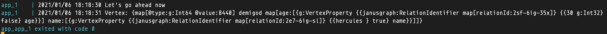
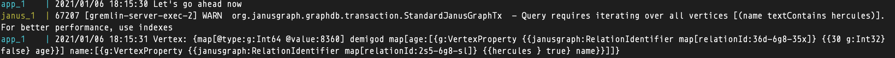

# Aim

We want to test out setting up of `Graph Indexes` and see if a query from a golang client makes use
of the created index. Specifically an index on the property `name`

Normaly `JanusGraph` will log out a warning when a traversal is done without making use of an index.
Checking out the `janus` app logs to monitor the warning, if thrown.

The `sample.groovy` is used to setup the indexes.

The `indexless.groovy` is used to load the graph without indexes

## 1. How to run the indexed setup

1. Open 3 terminals
2. In the first one: `docker-compose up -d`
3. Terminal one: `docker-compose logs -f janus`
4. Terminal three: `docker-compose logs -f app`

### Alternatively

You can start the containers without detaching and view all the logs from both apps in a single terminals
```
docker-compose up
```

### Expected output



## 2. How to run the indexless setup

1. Open 3 terminals
2. In the first one: `docker-compose -f docker-compose.indexless.yml up -d`
3. Terminal one: `docker-compose logs -f janus`
4. Terminal three: `docker-compose logs -f app`

### Alternatively

You can start the containers without detaching and view all the logs from both apps in a single terminals
```
docker-compose -f docker-compose.indexless.yml up
```

### Expected output



## Note worthy

You should execute `docker-compose down` after every run to remove any stopped containers before starting the containers again
